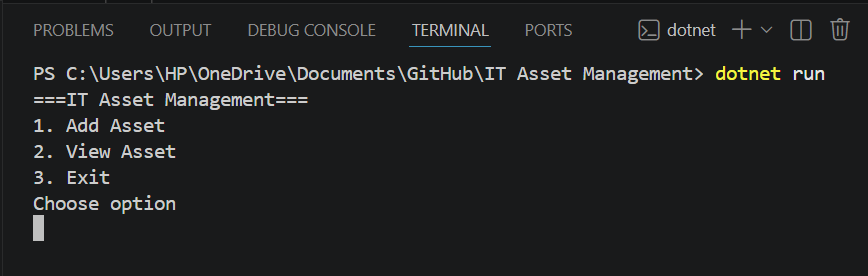
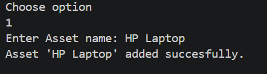
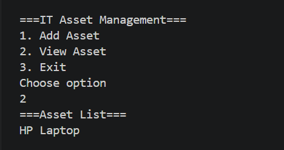
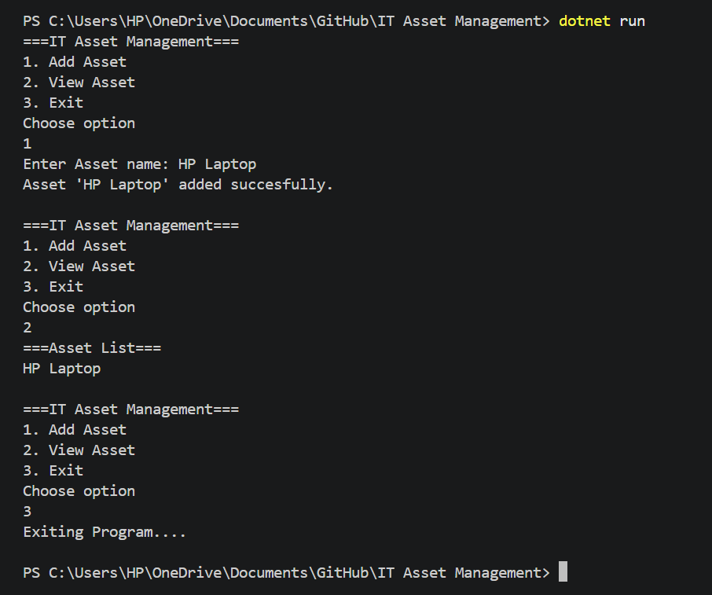

# IT Asset Management System
 A simple C# console application for managing IT assets within an organization.

 ## Features
 - Add assets
 - View Assets
 - Console-based menu system

 ## Technologies used
 - C#
 - .NET Console Application
 - Visual Studio code
 - Github

 ## screenshots

 ### Main Menu
 

 ### Adding assets
 

 ### View assets
 

 ### Exit Program
 

## Purpose
This project was created to improve practical software development skills and demonstrate understanding of IT operational systems such as asset tracking and management.

## Future Improvements
- Add database intergration
- Add asset catergories
- Add delete and update functionality
- Improve user interface